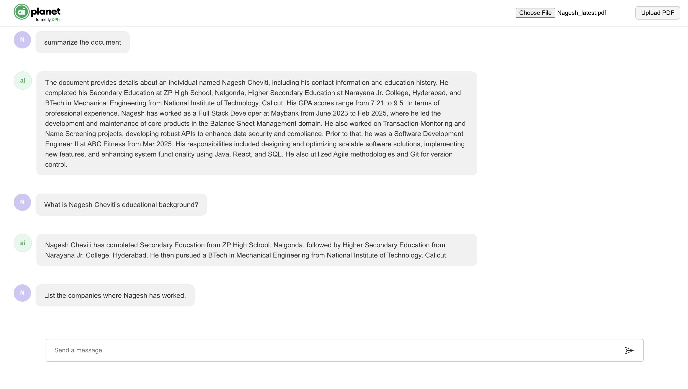

# 📄 PDF-QA-App

An interactive web application that allows users to upload a PDF and ask questions about its content. Built using **React** for the frontend and **FastAPI** for the backend, the app leverages **LlamaIndex** and **Together.ai** to generate intelligent answers based on the uploaded document.

---

## 🚀 Features

- Upload any PDF file
- Ask natural language questions about the document
- Get answers generated by a large language model
- Chat-like interface with conversational history
- Error handling for token overflows and invalid inputs

---

## 🖼️ Demo UI

---

## 🛠️ Tech Stack

### Frontend
- React.js
- Axios
- Toastify (for notifications)

### Backend
- FastAPI
- PyMuPDF (fitz)
- LlamaIndex
- Together.ai (LLM + Embedding APIs)

---

## 📁 Project Structure

